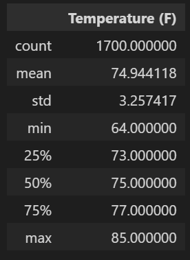

# surfs_up
## Overview of the statistical analysis 
### Purpose
This analysis is to perform some analytics on weather dataset for the months of June and December in Oahu, Hawaii and present it to W. Avy, an investor to assit him in determining whether a business plan to open a Surf and Shake shop on Oahu is sustainable year-round. 

## Results
### June Temperatures
We used Python, Pandas and SQLAlchemy to retrieve all the temperatures for the month of June. Then we converted those temperatures to a list, created a DataFrame from the list, and generated the summary statistics. See a comparison of the summary statistics to the image provided on the challenge instructions.

### December Temperatures
We used the same functions to retrieve all the temperatures for the month of December and followed the same steps to generate the summary statistics. See a comparison of the summary statistics to the image provided on the challenge instructions.

### Key Differences

* June's maximum temperature of 85 was higher than December's maximum temperature of 83. 
* June's average temperature of 74.9 was higher than December's average temperature of 71.0. 
* June's minimum temperature of 64 was higher than December's minimum temperature of 56. 

## Summary
Overall there are no significant differences in temperatures of June and December in terms of minimum, maximum and mean. We can conclude that the Surf and Shake shop could be sustainable year-round. However, it would be more helpful if we query the following additional data:  
1. precipitation
2. wind 

